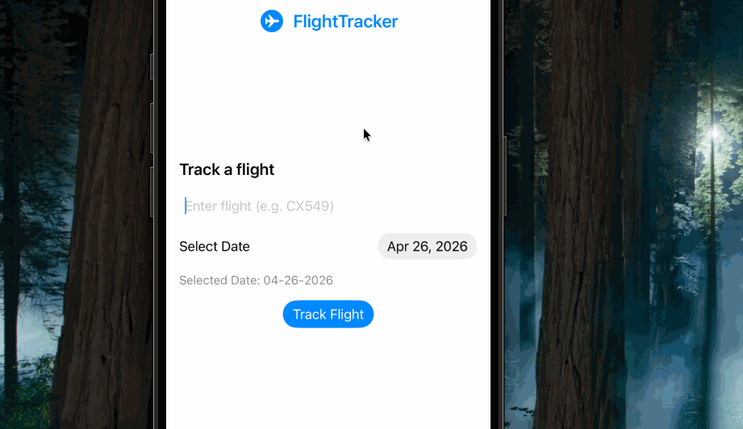

# FlightTracker

`FlightTracker` is a SwiftUI iPhone app for looking up live flight information by flight number and date.

## Features

- Search by flight number and travel date
- Live flight lookup using the AviationStack API
- Flight cards with:
  - airline name and code
  - flight number and status
  - departure and arrival airports
  - airport local times
  - device local times
  - timezone labels
  - expected flight duration
  - delay indicators when available
- Custom app launch screen with project branding
- Basic response caching to reduce repeated API calls for the same query

## Project Structure

- `FlightTracker/FlightTrackerApp.swift`: app entry point
- `FlightTracker/ContentView.swift`: main search and results UI
- `FlightTracker/Flight.swift`: flight data models
- `FlightTracker/FlightCardView.swift`: flight result card presentation
- `FlightTracker/FlightService.swift`: live API requests and caching
- `FlightTracker/LaunchScreen.storyboard`: launch screen
- `FlightTracker/Assets.xcassets`: app assets, colors, and icons

## Requirements

- Xcode
- iOS Simulator or physical iPhone
- Network access for live flight lookups

## Running the App

1. Open `FlightTracker.xcodeproj` in Xcode.
2. Select an iPhone simulator or connected device.
3. Build and run the app.
4. Enter a flight number such as `AA100` and tap `Track Flight`.

## API Notes

The app currently uses AviationStack for live flight data. Repeated identical searches are cached locally for a short period to reduce duplicate API calls.

## Screenshots

### App Flow

### Screens

## Known Notes

- The app icon asset must be a valid 1024x1024 PNG inside `AppIcon.appiconset`.
- Live API results depend on the data available from the provider.
